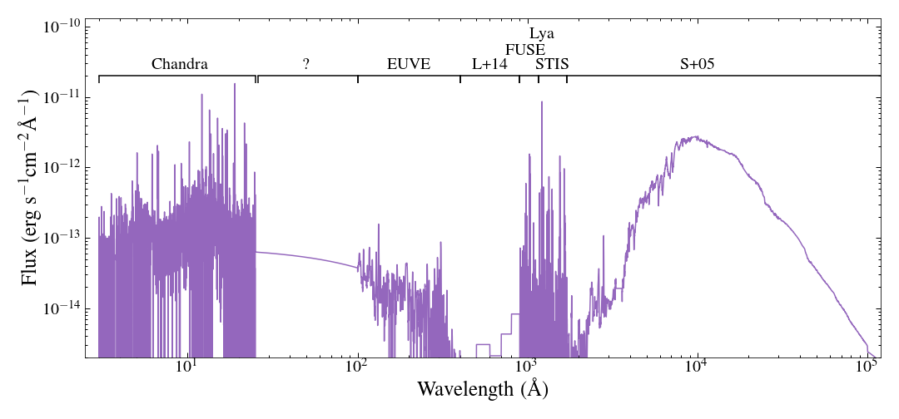

# ad-leo-sed
making a MUSCLES-esque SED of AD Leo

ad_leo_sed_v[].escv is the file you want. Not MUSCLES standard, but good enough for "how does [My Favourite Star] compare?" plots.
Sources/documentation to come, contact me if you want more details.
